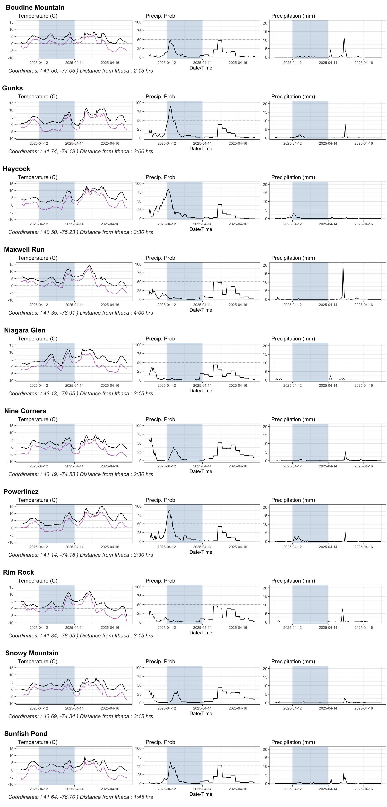

# weather

Forecast for selected climbing locations near(?) Ithaca, NY. Data are pulled from the Open-meteo Free Weather API. 

# Example

All available options can be found by running
```bash
> Rscript forecast.R --help
Usage: forecast.R [options]


Options:
        -v, --verbose
                Print extra output [default]

        -s STRING, --stats=STRING
                Statistics to curls: t = temperature, f = apparent temperature, p = precipitation, r = precipitation prob., h = relative humidity

        -o STRING, --output=STRING
                Output file. Only *.pdf and *.png allowed

        -d NUMBER, --days=NUMBER
                Number of days ahead to forecast

        -h, --help
                Show this help message and exit
```
For example, running
```bash
Rscript forecast.R -d 2 -s tp -o foo.pdf
```
will give you the forecast for the temperature and precipitation for the next two days and save it into the file `foo.pdf`.

- All forecasts are shown with black lines. The only exception is the apparent("feels like") temperature, which, if requested, is displayed as a purple line.
- Weekends are shaded in blue
- Temperature is measured in Celsius degrees and precipitation in mm/hr.
- New locations can be added (or existing ones can be dropped) by changing the `./data/coordinates.csv` file, which has four columns
    - Location (Name)
    - Latitude
    - Longitude
    - Drive (hrs drive from Ithaca)

An example plot is shown below, which was created with `Rscript forecast.R -d 5`

<p align="center">

</p>

Enjoy!